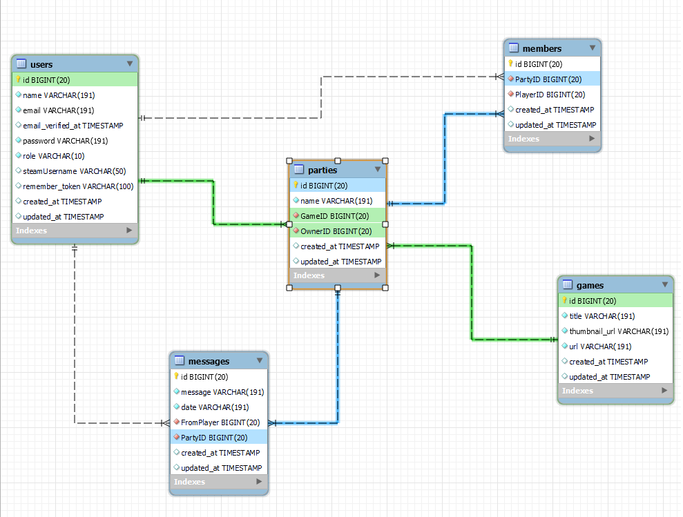

<p align="center"><a href="https://laravel.com" target="_blank"></a></p>


# Game site for Workers - Backend


## 0. Indice:


  [1. Introduccion:](#1-introducción)<br>
  [2. Como Usar:](#3-descripción-del-proyecto)<br>
  [3. Herramientas Utilizadas:](#5herramientas-utilizadas)<br>


## 1. Introducción.

- Dada la situación sanitaria, una empresa tecnológica ha estado trabajando en
remoto desde marzo de 2020. Esto ha implicado que nuestros compañeros
hayan perdido el contacto humano que siempre se ha tenido, y es algo que la
empresa desea cambiar.
- La empresa quiere dar un impulso a la manera que tienen los trabajadores de
relacionarse, permitiendo que contacten entre ellos creando grupos de interés.
Una primera fase de este proyecto es crear un BACKEND, que
permita que los empleados puedan contactar con otros compañeros para
formar grupos para jugar a un videojuego, con el objetivo de poder compartir
un rato de ocio afterwork. <br>
  
- BackEnd and BBDD Deployed on [HEROKU](https://php-laravel-backend.herokuapp.com)<br>
- Aquí una imagen del diseño de la Base de datos :
  
 

## 2. Como Usar.

- Este proyecto esta deployado en HEROKU por lo cual para probarlo solo tendras que tener una herramienta llamada POSTMAN la cual te permite probar el CRUD de los endpoints.
  <br>

- A traves de este enlace tendras todos los endpoints con sus campos para que resulte mas sencillo probar el backend:
  
 [](https://god.postman.co/run-collection/f92903917e2ce0f81955?action=collection%2Fimport)

- Tendrás que registrarte por POSTMAN y hacer Login para obtener el JWT, que te autorizara a ejecutar el resto de EndPoints.


<br>
    
A continuacion se describen las posibilidades que tienes:

### EndPoints de Users :

Ejemplo: https://php-laravel-backend.herokuapp.com/api/register

- Registro :
  
  ```bash
  Route::post('/register', [AuthController::class, 'register']);
  ```

- Login : 
  
  ```bash
  Route::post('/login', [AuthController::class, 'login']);
  ```

- Logout : 
  
  ```bash
  Route::post('/logout', [AuthController::class, 'logout']);
  ```

- Profile :
  
   ```bash
  Route::get('/me', [AuthController::class, 'me']);
  ```

- All Users :
  
   ```bash
  Route::get('/users', [UserController::class, 'allUsers']);
  ```

- User By Id :
  
   ```bash
  Route::get('/users/{id}', [UserController::class, 'userByID']);
  ```

- Update User By Id :
  
   ```bash
  Route::put('/users/{id}', [UserController::class, 'updateUser']);
  ```

- Delete User By Id :
  
   ```bash
  Route::delete('/users/{id}', [UserController::class, 'deleteUser']);
  ```


<br>


### EndPoints de Games :

Ejemplo: https://php-laravel-backend.herokuapp.com/api/games

- All Games :
  
  ```bash
  Route::get('/games', [GamesController::class, 'allGames']);
  ```

- New Game :
  
  ```bash
  Route::post('/games', [GamesController::class, 'newGame']);
  ```

- Get Game By ID :
  
  ```bash
  Route::get('/games/{id}', [GamesController::class, 'gameByID']);
  ```

- Update Game By ID :
  
  ```bash
  Route::put('/games/{id}', [GamesController::class, 'updateGame']);
  ```

- Dalete Game By ID :
  
  ```bash
  Route::delete('/games/{id}', [GamesController::class, 'deleteGame']);
  ```

<br>

### EndPoints de Parties :

Ejemplo: https://php-laravel-backend.herokuapp.com/api/parties

- All Parties :
  
  ```bash
  Route::get('/parties', [PartyController::class, 'allParties']);
  ```

- New Party :
  
  ```bash
  Route::post('/parties', [PartyController::class, 'newParty']);
  ```

- Get Party By ID :
  
  ```bash
  Route::get('/parties/{id}', [PartyController::class, 'partyByID']);
  ```

- Update Party By ID :
  
  ```bash
  Route::put('/parties/{id}', [PartyController::class, 'updateParty']);
  ```

- Delete Party By ID :
  
  ```bash
  Route::delete('/parties/{id}', [PartyController::class, 'deleteParty']);
  ```

- Get Parties By GAME ID :
  
  ```bash
  Route::get('/partie/game/{id}', [PartyController::class, "partiesByGameID"]);
  ```
   
<br>

### EndPoints de Messages :

Ejemplo: https://php-laravel-backend.herokuapp.com/api/messages

- All Messages :
  
  ```bash
  Route::get('/messages', [MessageController::class, 'allMessages']);
  ```

- New Messages :
  
  ```bash
  Route::post('/messages', [MessageController::class, 'newMessage']);
  ```

- Get Messages By ID :
  
  ```bash
  Route::get('/messages/{id}', [MessageController::class, 'messageByID']);
  ```

- Update Message By ID :
  
  ```bash
  Route::put('/messages/{id}', [MessageController::class, 'updateMessage']);
  ```

- Delete Message By ID :
  
  ```bash
  Route::delete('/messages/{id}', [MessageController::class, 'deleteMessage']);
  ```

- Get Messages By PARTY ID :
  
  ```bash
  Route::get('/message/party/{id}', [MessageController::class, "messagesByPartyID"]);
  ```
   

<br>

### EndPoints de Members :

Ejemplo: https://php-laravel-backend.herokuapp.com/api/members

- All Members :
  
  ```bash
  Route::get('/members', [MemberController::class, 'allMembers']);
  ```

- New Member :
  
  ```bash
  Route::post('/members', [MemberController::class, 'newMember']);
  ```

- Get Member By ID :
  
  ```bash
  RRoute::get('/members/{id}', [MemberController::class, 'memberByID']);
  ```

- Update Member By ID :
  
  ```bash
  Route::put('/members/{id}', [MemberController::class, 'updateMember']);
  ```

- Delete Member By ID :
  
  ```bash
  Route::delete('/members/{id}', [MemberController::class, 'deleteMember']);
  ```

- Get Members By PARTY ID :
  
  ```bash
  Route::get('/member/party/{id}', [MemberController::class, "membersByPartyID"]);
  ```

<br>

## 3. Herramientas Utilizadas.

- MySQL Workbench - (BBDD)
- Visual Studio Code - (DEV)
- Postman - (DEBUG)
- Heroku - (DEPLOY)

<br>


[Subir](#top)